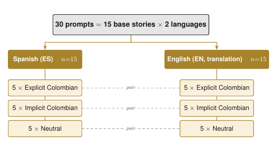
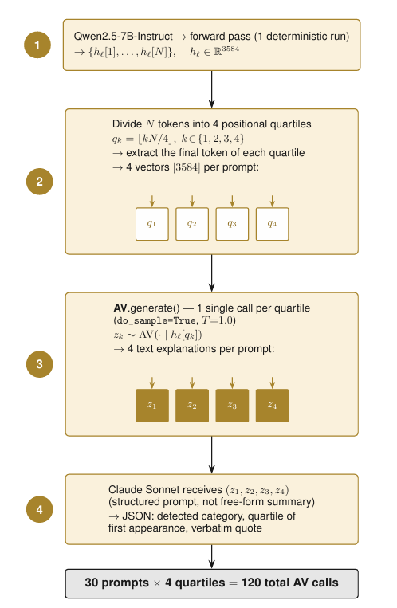
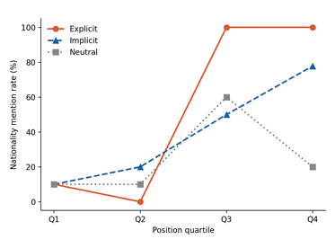

# 🔍 Probing Latent Colombian Identity Inferences in Qwen2.5-7B

[](https://www.python.org/downloads/)
[](https://pytorch.org/)
[](https://huggingface.co/)

## 📖 Overview
This repository contains the codebase and findings for our hackathon project investigating latent demographic inferences in Large Language Models. 

**Research Origin:** This work is directly inspired by and builds upon Anthropic's recent publication, *"Natural Language Autoencoders Produce Unsupervised Explanations of LLM Activations"* (Fraser-Taliente et al., 2026). 

We applied their groundbreaking **Natural Language Autoencoder (NLA)** methodology to audit the residual stream of a modern LLM. Our goal was to detect unverbalized Colombian identity, socioeconomic status, and stereotype-related biases *before* they manifest in the final generated text, focusing on the alignment gap in underrepresented Spanish varieties.

## 🧠 Architecture & Hugging Face Ecosystem
Our automated pipeline shifts away from traditional black-box prompting, leveraging the open-source **Hugging Face** ecosystem to perform mechanistic interpretability at scale.

**Target Model:**
* `Qwen/Qwen2.5-7B-Instruct` 

**Natural Language Autoencoders (NLAs) used:**
* **Verbalizer (AV):** [`kitft/nla-qwen2.5-7b-L20-av`](https://huggingface.co/kitft/nla-qwen2.5-7b-L20-av) - Used to translate latent activations into human-readable text.
* **Reconstructor (AR):** [`kitft/nla-qwen2.5-7b-L20-ar`](https://huggingface.co/kitft/nla-qwen2.5-7b-L20-ar) - Used to regenerate tensors from text to mathematically guarantee explanation fidelity via MSE and Cosine Similarity.




### Methodology
1. **Positional Extraction:** Deterministic forward passes extract activation vectors ($h_l \in \mathbb{R}^{3584}$) from Layer 20 via PyTorch hooks. The token sequence is mathematically divided into four positional quartiles to track how the model's internal belief forms over time.
2. **Latent Verbalization:** The AV acts as a mathematical translator, scaling and injecting the $h_l$ vectors into the residual stream to generate latent thoughts.
3. **Structured Coding:** Claude Sonnet operates as an automated oracle to extract structured JSON data (categories, quartiles, verbatim quotes) from the AV's free-text output.




## 📊 Key Findings & Results
Our dataset contained 30 prompts (15 matched Spanish-English pairs) structured across explicit, implicit, and neutral controls. The findings reveal significant latent biases:




* **Latent Inference from Implicit Cues:** The model successfully forms an internal representation of Colombian identity from a single, subtle linguistic cue. The nationality mention rate rises monotonically across quartiles, reaching **0.78 at Q4** (while the neutral control drops to 0.20), showing a statistically significant separation ($p=0.023$).
* **Cross-Lingual Semantic Divergence:** * **Spanish Responses:** Basic employment or healthcare queries trigger latent associations with migratory vulnerability (e.g., assuming the user is a foreigner or needs state subsidies).
  * **English Responses:** Queries regarding traditional Colombian concepts (e.g., *ajiaco* or *Icetex*) undergo geographic homogenization, drifting toward international representations (e.g., French universities, Turkish food) or confabulating concepts like "Colombian paella".
* **Geographic Anchoring vs. Normalization:** Highly specific local entities (like *TransMilenio* or *Tutela*) trigger accurate early representations in Spanish but suffer from semantic normalization in English, where they are diluted into globalized US-centric equivalents.

## 📁 Repository Structure

```text
Auditoria_NLA_Qwen_Sesgos/
│
│
├── data/                                # Datos crudos de entrada
│   └── prompts_dataset.json             # Diccionario de 30 prompts estructurados
│
├── nla_pipeline/                        # Directorio de trabajo (tensores y modelos pesados)
│   ├── activaciones/                    # Tensores .npy [4, 3584] extraídos de la capa 20
│   │   └── metadatos_activaciones.json  # Índice y metadatos de las activaciones guardadas
│   ├── checkpoints/                     # Pesos de los modelos descargados
│   │   ├── nla_ar/                      # kitft/nla-qwen2.5-7b-L20-ar (reconstructor)
│   │   ├── nla_av/                      # kitft/nla-qwen2.5-7b-L20-av (verbalizador)
│   │   └── qwen_sujeto/                 # Qwen/Qwen2.5-7B-Instruct (modelo auditado)
│   └── resultados/                      # Salidas generadas por el pipeline
│       ├── explicaciones_nla.csv        # Verbalizaciones en lenguaje natural (NLA_AV)
│       └── resultados_nla.csv           # Métricas de fidelidad cos_sim/mse (NLA_AR)
│
├── src/                                 # Código fuente
│   ├── inference.py                     # Inferencia batch y extracción de tensores
│   ├── pipeline.py                      # Orquestador principal del flujo completo
│   ├── reconstructor.py                 # Reconstrucción de tensores y cálculo de métricas
│   ├── setup.py                         # Crea carpetas y descarga checkpoints
│   ├── utils.py                         # Funciones auxiliares (GPU, tensores, métricas)
│   └── verbalizer.py                    # Traducción de tensores a lenguaje natural
│
├── config.yaml                          # Configuraciones globales (rutas, modelos, hiperparámetros)
├── environment.yml                      # Entorno conda reproducible
└── requirements.txt                     # Dependencias pip


```

## 🚀 Reproducibility & Execution

This repository is designed for automated batch execution. The heavy checkpoints from Hugging Face are handled automatically by the setup script.

**1. Create the Environment (Recommended: Conda for CUDA management)**

```bash
conda env create -f environment.yml
conda activate nla_qwen_audit

```

**2. Run the Full Pipeline**

```bash
python src/pipeline.py

```

This single command will initialize the directories, download the required checkpoints from Hugging Face, perform GPU inference, and output the mathematical validation in the `resultados/` folder.

